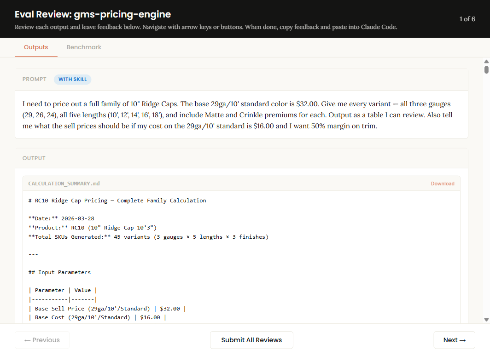

# gms-intelligence-plugin

[](./LICENSE)
[](https://claude.com/claude-code)
[](./skills)
[](./evals)

> A Claude Code plugin that encodes a metal-roofing manufacturer's domain knowledge as 7 eval-scored skills. Built as a real-world case study for Greenfield Metal Sales — also serves as a reusable template for building domain-expert Claude Code plugins in other verticals.

[](https://mattamundson.github.io/gms-intelligence-plugin/evals/gms-pricing-engine-eval-review.html)

*↑ A live eval review page. Click through for the full Sonnet-executor / Opus-grader breakdown of every prompt, every assertion, for all 7 skills.*

## What this is

Most "put Claude in a business" experiments end up as a RAG pipeline indexing random documentation. This plugin takes the opposite approach: **structured, progressive-disclosure skills** where each skill encodes one domain (pricing formulas, SKU structure, material sourcing, color catalogs, production workflow, supplier intelligence, inventory health) in markdown + Python.

When Claude sees a user query, only the relevant skill loads. A pricing question loads pricing-engine (~13K words); it does not load the supplier catalog or the color system. The load graph is explicit and readable.

Why that matters for recruiters looking at this repo:
- **7 working skills** — not slideware. Each has a `SKILL.md`, eval set, references (where relevant), and for the two most important skills, actual Python validators.
- **Eval-driven development** — every skill was evaluated with a "with-skill executor" (Sonnet) graded by Opus against concrete assertions. Eval review HTMLs ship in `/evals/`.
- **Zero training data required** — this is not fine-tuning. The skills are plain markdown that any Claude Code user can install and run today.
- **Real Python, not pseudo-code** — `skills/gms-pricing-engine/scripts/` ships `calculate_quote.py` (24KB), `margin_analyzer.py` (22KB), `validate_pricing.py` (22KB). `skills/gms-sku-decoder/scripts/` ships `sku_decoder.py` (34KB) and `sku_encoder.py` (19KB).

## The 7 skills

| Skill | What it encodes | Assets |
|---|---|---|
| **gms-pricing-engine** | Sell-price formula (`base × gauge × length × finish`), gauge/length/finish multipliers, margin targets per product category, what-if analysis | SKILL.md + 5 reference docs (coil-pricing, color-codes, margin-tables, panel-specs, trim-profiles) + 3 Python scripts + evals |
| **gms-sku-decoder** | 91K+ product-ID catalog, family/gauge/color/length parsing, pattern A vs B material sourcing, reverse encoding (description → PID) | SKILL.md + 2 reference docs (color-to-code, family-registry) + 2 Python scripts + evals |
| **gms-material-estimator** | Panel/trim quantities from building dimensions, waste factors, stretchout math | SKILL.md + references + evals |
| **gms-color-authority** | 165+ colors across SMP (USS supplier) and Kynar/PVDF (CMG supplier) paint systems, contractor aliases, premium-finish markup logic | SKILL.md + evals |
| **gms-production-nav** | Assembly relationships, labor operations, manufacturing feasibility, coil → product traceability | SKILL.md + evals |
| **gms-supplier-intel** | Supplier routing (USS vs CMG), lead times, reorder points, coil specs, PO workflow | SKILL.md + evals |
| **gms-inventory-health** | Stock level modeling, velocity analysis, dead stock detection, reorder recommendations | SKILL.md + evals |

## Commands

The plugin also exposes 3 slash commands that invoke the most common workflows:

- `/quote <description>` — quick-quote a product with full cost breakdown (pricing-engine)
- `/decode <PID>` — decode a product SKU into human-readable components (sku-decoder)
- `/color <name-or-code>` — look up any color by name, code, or contractor alias (color-authority)

## Eval methodology

Every skill was evaluated by spinning up two Claude instances:
- **Executor** (`claude-sonnet-4-5`) — given the user prompt + the skill, produces an answer.
- **Grader** (`claude-opus-4-6`) — checks the answer against a hand-written assertion set in the skill's `evals/evals.json`.

This catches regressions that human eyeballing misses. When I tightened the gauge multiplier from +20%-per-step to an exact table, the eval grader caught three places in the skill where the old formula still appeared in reference docs — I'd never have found those by reading.

The full eval-review HTMLs ship in `/evals/` and render live via GitHub Pages:

- [gms-pricing-engine](https://mattamundson.github.io/gms-intelligence-plugin/evals/gms-pricing-engine-eval-review.html) — **30/36 passed (83%)**
- [gms-sku-decoder](https://mattamundson.github.io/gms-intelligence-plugin/evals/gms-sku-decoder-eval-review.html)
- [gms-material-estimator](https://mattamundson.github.io/gms-intelligence-plugin/evals/gms-material-estimator-eval-review.html)
- [gms-color-authority](https://mattamundson.github.io/gms-intelligence-plugin/evals/gms-color-authority-eval-review.html)
- [gms-production-nav](https://mattamundson.github.io/gms-intelligence-plugin/evals/gms-production-nav-eval-review.html)
- [gms-supplier-intel](https://mattamundson.github.io/gms-intelligence-plugin/evals/gms-supplier-intel-eval-review.html)
- [gms-inventory-health](https://mattamundson.github.io/gms-intelligence-plugin/evals/gms-inventory-health-eval-review.html)

Each report shows every prompt, the with-skill output, the baseline (no-skill) output, and the assertion-by-assertion grading.

**One concrete number worth knowing:** the pricing-engine eval (3 evals, 36 total assertions) passes **30/36 = 83%** — the 6 misses are edge cases around Pattern B material pricing that I've documented as known-limitations in the skill's `common-mistakes` section.

## Install

```bash
# from a cloned copy of this repo
claude plugin install ./
```

Or via the Claude Code marketplace flow (when published):

```bash
claude plugin marketplace add mattamundson/gms-intelligence-plugin
claude plugin install gms-intelligence
```

Skills live under `~/.claude/plugins/gms-intelligence/skills/` after install. Delete to uninstall.

## Repository layout

```
.claude-plugin/
  plugin.json              # manifest consumed by `claude plugin install`
skills/
  gms-pricing-engine/      # SKILL.md + references/ + scripts/ + evals/
  gms-sku-decoder/
  gms-material-estimator/
  gms-color-authority/
  gms-production-nav/
  gms-supplier-intel/
  gms-inventory-health/
commands/
  quote.md                 # /quote — price a product
  decode.md                # /decode — parse a SKU
  color.md                 # /color  — look up a color
evals/
  *-eval-review.html       # eval-grader output per skill
docs/
  CASE-STUDY.md            # project context, methodology, and scope notes
  INSTALL.md               # detailed install / troubleshooting
```

## Why I built it this way (pattern to steal)

If you're building a Claude Code plugin for **your** business, the pattern that worked here:

1. **One skill per domain, not one skill per task.** "Pricing" is a domain. "Generate a quote" is a task. The domain skill answers 100 task-shaped questions; a task skill answers 1.
2. **Triggers on intent, not keywords.** The `description` field in each skill's frontmatter is how Claude decides whether to load it. Write it as "when the user asks X, Y, or Z, load me" — not as a keyword list.
3. **References as separate files, not inline.** Long reference tables (color codes, panel specs, margin tables) live in `references/*.md` and load lazily. The main `SKILL.md` stays scannable.
4. **Evals from day one.** The moment a skill has its first assertion, it's testable. You can refactor the skill without breaking behavior.
5. **Safety rails in the SKILL.md itself.** The pricing skill's first section is literally "NEVER auto-execute pricing changes. Always preview, show before/after, require explicit CONFIRM." Claude reads and obeys this exactly like any other instruction.

## Scope note

This repo ships 7 of the 11 skills from the production system. The other 4 (competitive battlecard, sales outreach, customer intelligence, and an internal dev-assistant skill) aren't in the public repo — see [`docs/CASE-STUDY.md`](./docs/CASE-STUDY.md) for why and what they did.

## License

MIT — see [LICENSE](./LICENSE).

## Author

Matt Amundson. Built in early 2026 while Greenfield Metal Sales was standing up its AI operations center.
